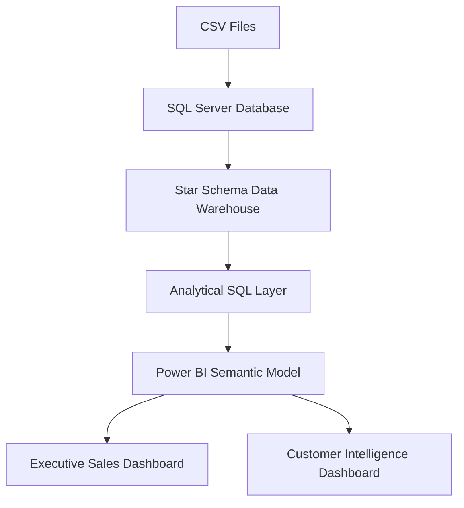

# Retail Sales Data Warehouse & Business Intelligence Platform

An end-to-end Business Intelligence solution built using SQL Server, Power BI, and DAX for sales performance monitoring, customer intelligence, and product analytics.

The project follows a dimensional modeling approach using a star-schema data warehouse and delivers executive reporting through interactive Power BI dashboards.

## Project Architecture

## Data Model

### Fact Table
- gold.fact_sales

### Dimension Tables
- gold.dim_customers
- gold.dim_products

### Design Pattern
- Star Schema
- One-to-Many Relationships
- Dimensional Modeling

## Business Metrics

| Metric | Value |
|----------|----------|
| Revenue | ₹29.36M |
| Orders | 27.66K |
| Customers | 18.48K |
| Quantity Sold | 60.42K |
| Average Order Value | ₹1.06K |

## Technical Skills Demonstrated

### SQL Server
- Views
- CTEs
- Window Functions
- LAG()
- PARTITION BY
- Running Totals

### Data Warehousing
- Star Schema
- Fact & Dimension Modeling
- Data Integration

### Power BI
- DAX Measures
- KPI Development
- Interactive Dashboards
- Business Intelligence Reporting

  ## Executive Sales Performance Dashboard

## Customer Intelligence & Segmentation Dashboard

## Key Business Insights

- Bikes contributed over 95% of total revenue
- Mountain-200 series emerged as the top-performing product line
- Revenue exceeded ₹29M across 27K+ orders
- Majority of customers were aged 50 and above
- Average customer lifespan was 5.17 months
- Average revenue per customer was ₹1.59K

## Author

**Shreya Reddy**

Built an end-to-end Retail Sales Data Warehouse & Business Intelligence Platform leveraging SQL Server, Dimensional Modeling, Advanced SQL Analytics, Power BI, and DAX.

### Core Competencies

`SQL Server` • `Data Warehousing` • `Star Schema` • `Power BI` • `DAX` • `Window Functions` • `Business Intelligence`
